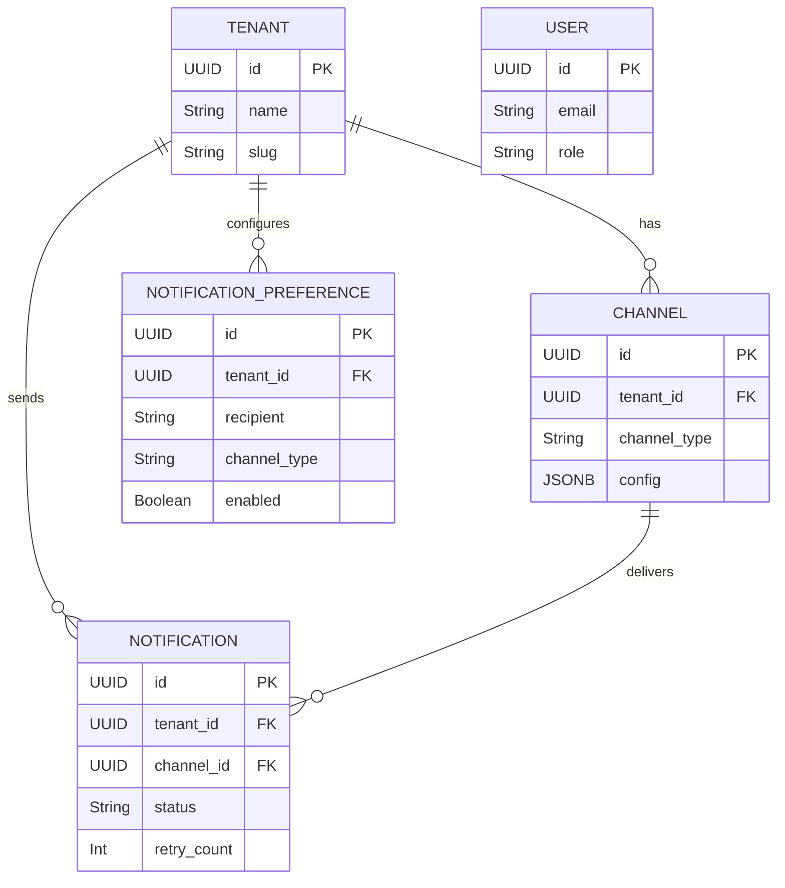

# Notification Service

## 1. Project Overview
A production-grade Notification Service backend built with Kotlin, Spring Boot 3, PostgreSQL, RabbitMQ, and Redis. It provides a robust, scalable architecture for managing tenants, configuring delivery channels, and sending asynchronous notifications with built-in failure recovery. Security is enforced via stateless JWT authentication and role-based access control.

## 2. Architecture Diagram

```mermaid
graph TD
    Client[Client / Gateway] -->|HTTP POST| API(Notification Controller)
    API --> Auth(JWT Filter)
    Auth --> Service(Notification Service)
    
    Service <-->|Cache Aside| Redis[(Redis Cache)]
    Service <-->|Write| DB[(PostgreSQL)]
    
    Service -->|Publish Event| Exchange((RabbitMQ Exchange))
    Exchange --> Queue(Notification Queue)
    
    Worker(Notification Consumer) <--|Consume| Queue
    Worker -->|Strategy Pattern| Providers(Email, SMS, Push)
    Worker <-->|Update Status| DB
    
    Providers -- "Permanent Fail" --> DLQ(Dead Letter Queue)
    Providers -- "Transient Fail" --> Retry(Exponential Backoff)
```

## 3. Database Design



## 4. API Documentation

Full interactive documentation is available via SpringDoc OpenAPI.

| Resource | URL |
|---|---|
| Swagger UI | `http://localhost:8080/swagger-ui.html` |
| OpenAPI JSON | `http://localhost:8080/api-docs` |
| Actuator Health | `http://localhost:8080/actuator/health` |
| Actuator Metrics | `http://localhost:8080/actuator/metrics` |

### Key Endpoints:
- `POST /api/v1/auth/login` - Authenticate and retrieve JWT
- `POST /api/v1/tenants/{id}/notifications` - Create a notification. Supports `Idempotency-Key` header.
- `GET /api/v1/tenants/{id}/notifications` - List history (paginated)

## 5. Setup Instructions

### Local Development
1. Start the infrastructure via Docker Compose:
```bash
docker-compose up postgres rabbitmq redis -d
```
2. Run the application:
```bash
./gradlew bootRun --args='--spring.profiles.active=local'
```

### Production (Full Stack in Docker)
To run the entire suite (DB, Message Broker, Cache, and App):
```bash
docker-compose up --build -d
```

### Testing
The project uses **Testcontainers** to spin up ephemeral Postgres and RabbitMQ instances. No external dependencies required.
```bash
./gradlew test
```

## 6. Environment Variables

| Variable | Description | Default |
|---|---|---|
| `APP_JWT_SECRET` | Secret key for JWT signing | `notification-service-jwt-secret-change-in-production` |
| `POSTGRES_USER` | DB Username | `notif_user` |
| `POSTGRES_PASSWORD`| DB Password | `notif_pass` |
| `RABBITMQ_USER` | Broker Username | `guest` |
| `RABBITMQ_PASSWORD`| Broker Password | `guest` |

## 7. Design Decisions

1. **Strategy Pattern for Providers**: Used to dynamically load specific sender implementations (Email, SMS) at runtime based on the channel type. Adheres to Open-Closed Principle.
2. **RabbitMQ with Dead Letter Queue**: Decouples API latency from external API response times. The DLQ isolates poison messages preventing consumer blocking.
3. **Redis Cache-Aside**: Notification preferences are cached in Redis to minimize database hits during peak loads.
4. **Idempotency**: Redis atomic `setIfAbsent` operations prevent duplicate notification processing if clients retry network timeouts.
5. **JSONB Configuration**: The `Channel` entity uses a JSONB column to flexibly store varying credentials for different providers without messy EAV tables.

## 8. Future Improvements

- **Rate Limiting**: Implement API rate-limiting per tenant using Redis Token Bucket.
- **Batch Processing**: Introduce chunking for bulk notification blasts.
- **Template Engine**: Add an engine (e.g., FreeMarker/Thymeleaf) for rich HTML emails.
- **Kubernetes**: Add Helm charts for k8s deployment.
